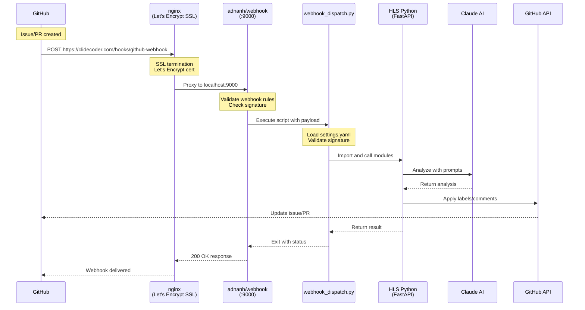

# HLS GitHub Webhook Handler

> 🤖 AI-powered GitHub webhook handler with Claude Code integration for intelligent issue and PR analysis

## Overview

The HLS (Hook Line Sinker) webhook handler is a production-ready GitHub webhook service that uses Claude AI to automatically analyze issues, pull requests, and other GitHub events. It features advanced chained prompts for multi-step analysis and automatic backup processing via cron jobs.

## Architecture Overview

### Web Sequence Diagram



### Component Configuration

#### 1. **nginx Configuration** (`/etc/nginx/sites-available/clidecoder.com`)
```nginx
server {
    server_name clidecoder.com;
    
    # Webhook endpoint - proxy to adnanh/webhook service
    location /hooks {
        proxy_pass http://localhost:9000;
        proxy_http_version 1.1;
        proxy_set_header Host $host;
        proxy_set_header X-Real-IP $remote_addr;
        proxy_set_header X-Forwarded-For $proxy_add_x_forwarded_for;
        proxy_set_header X-Forwarded-Proto $scheme;
        
        # Preserve GitHub webhook headers
        proxy_set_header X-GitHub-Event $http_x_github_event;
        proxy_set_header X-GitHub-Delivery $http_x_github_delivery;
        proxy_set_header X-Hub-Signature-256 $http_x_hub_signature_256;
        
        # Timeouts for webhook processing
        proxy_connect_timeout 10s;
        proxy_send_timeout 10s;
        proxy_read_timeout 300s;  # 5 minutes for Claude processing
        
        # Body size for large PR payloads
        client_max_body_size 10M;
        client_body_buffer_size 128k;
    }
    
    # Let's Encrypt SSL configuration
    listen 443 ssl;
    ssl_certificate /etc/letsencrypt/live/clidecoder.com/fullchain.pem;
    ssl_certificate_key /etc/letsencrypt/live/clidecoder.com/privkey.pem;
    include /etc/letsencrypt/options-ssl-nginx.conf;
    ssl_dhparam /etc/letsencrypt/ssl-dhparams.pem;
}

# HTTP to HTTPS redirect
server {
    listen 80;
    server_name clidecoder.com;
    return 301 https://$server_name$request_uri;
}
```

#### 2. **adnanh/webhook Configuration** (`services/hooks.json`)
```json
[
  {
    "id": "github-webhook",
    "execute-command": "/home/clide/hls/webhook_dispatch.py",
    "command-working-directory": "/home/clide/hls",
    "response-message": "Webhook received",
    "pass-arguments-to-command": [
      {
        "source": "entire-payload"
      }
    ],
    "pass-environment-to-command": [
      {
        "source": "header",
        "name": "X-GitHub-Event",
        "envname": "GITHUB_EVENT"
      },
      {
        "source": "header",
        "name": "X-GitHub-Delivery",
        "envname": "GITHUB_DELIVERY"
      },
      {
        "source": "header",
        "name": "X-Hub-Signature-256",
        "envname": "GITHUB_SIGNATURE"
      }
    ],
    "trigger-rule": {
      "match": {
        "type": "value",
        "value": "application/json",
        "parameter": {
          "source": "header",
          "name": "Content-Type"
        }
      }
    }
  }
]
```

#### 3. **HLS Configuration** (`config/settings.yaml`)
```yaml
github:
  webhook_secret: "your-secret-here"  # Same as GitHub webhook config
  token: "ghp_..."                    # GitHub PAT for API calls

repositories:
  - name: "clidecoder/hls"
    events: ["issues", "pull_request"]
    settings:
      apply_labels: true
      post_analysis_comments: true
      auto_close_invalid: false

features:
  signature_validation: true          # Verify webhook signatures
  async_processing: false            # Process synchronously
```

## ✨ Key Features

### 🧠 **AI-Powered Analysis**
- **Chained Prompts** - Multi-step analysis for better AI reasoning and context preservation
- **Smart Labeling** - Automatically applies relevant labels based on content analysis  
- **Priority Assessment** - Determines issue priority and complexity
- **Intelligent Comments** - Generates contextual responses and feedback

### 🛡️ **Production Ready**
- **nginx Integration** - SSL termination and load balancing
- **Backup Processing** - Cron jobs catch missed webhooks automatically
- **Error Recovery** - Comprehensive error handling and retry logic
- **Monitoring** - Structured logging, health checks, and performance metrics

### ⚙️ **Advanced Features**
- **Context Awareness** - Maintains conversation history between prompt steps
- **Repository Filtering** - Per-repository configuration and event filtering
- **Rate Limiting** - Respects GitHub and Claude API limits
- **Webhook Validation** - Secure signature verification

## Quick Start

### Prerequisites
- Python 3.8+ with virtual environment
- nginx with SSL certificates
- webhook service (adnanh/webhook)
- GitHub Personal Access Token
- Claude Code CLI (or Anthropic API Key if not using Max plan)
- Public domain with SSL (e.g., clidecoder.com)

### Installation

#### 1. Set up Let's Encrypt SSL certificate
```bash
# Install certbot
sudo apt update
sudo apt install certbot python3-certbot-nginx

# Get SSL certificate
sudo certbot --nginx -d clidecoder.com -d www.clidecoder.com

# Test auto-renewal
sudo certbot renew --dry-run
```

#### 2. Install webhook service
```bash
# Install webhook service (adnanh/webhook)
# Option 1: Download binary from GitHub releases
wget https://github.com/adnanh/webhook/releases/download/2.8.0/webhook-linux-amd64.tar.gz
tar -xvf webhook-linux-amd64.tar.gz

# Option 2: Install with go
go install github.com/adnanh/webhook@latest
```

#### 3. Clone and setup HLS
```bash
# Clone the repository
git clone https://github.com/clidecoder/hls.git
cd hls

# Create virtual environment
python3 -m venv venv
source venv/bin/activate

# Install dependencies
pip install -r requirements.txt

# Copy configuration
cp config/settings.example.yaml config/settings.yaml
```

#### 4. Configure nginx
Add to your nginx site configuration:
```nginx
server {
    server_name your-domain.com;
    
    # Webhook endpoint for GitHub
    location /hooks {
        proxy_pass http://localhost:9000;
        proxy_http_version 1.1;
        proxy_set_header Host $host;
        proxy_set_header X-Real-IP $remote_addr;
        proxy_set_header X-Forwarded-For $proxy_add_x_forwarded_for;
        proxy_set_header X-Forwarded-Proto $scheme;
        
        # Preserve GitHub webhook headers
        proxy_set_header X-GitHub-Event $http_x_github_event;
        proxy_set_header X-GitHub-Delivery $http_x_github_delivery;
        proxy_set_header X-Hub-Signature-256 $http_x_hub_signature_256;
        
        # Increase timeout for Claude processing
        proxy_read_timeout 300s;
        client_max_body_size 10M;
    }
    
    listen 443 ssl;
    # SSL certificates configured by certbot or manually
}
```

### Configuration

#### 1. Edit `config/settings.yaml`:
```yaml
github:
  token: "ghp_your_github_token"
  webhook_secret: "generate_secure_secret_with_openssl"
  
claude:
  api_key: "claude-code"  # or your Anthropic API key

repositories:
  - name: "your-org/your-repo"
    enabled: true
    events: ["issues", "pull_request"]
    labels:
      auto_apply: true
    comments:
      auto_post: true

features:
  signature_validation: true
  auto_labeling: true
  auto_commenting: true
```

#### 2. Generate webhook secret:
```bash
# Generate secure webhook secret
openssl rand -hex 32
```

#### 3. Update webhook dispatch script shebang:
```bash
# Edit webhook_dispatch.py first line to use venv Python
#!/home/your-user/hls/venv/bin/python
```

#### 4. Set up GitHub webhook:
```bash
# Use the setup script
source venv/bin/activate
python setup_github_webhook.py

# Or manually in GitHub repository settings:
# - URL: https://your-domain.com/hooks/github-webhook
# - Content type: application/json
# - Secret: Same as webhook_secret in settings.yaml
# - Events: Issues, Pull requests, etc.
```

### Running

#### 1. Start webhook service with pm2:
```bash
# Install pm2 globally
npm install -g pm2

# Start webhook service
pm2 start services/pm2/ecosystem.config.js

# Save pm2 configuration
pm2 save

# Set up pm2 to start on boot
pm2 startup
```

#### 2. Or start webhook service manually:
```bash
# Run webhook service (port 9000)
webhook -hooks services/hooks.json -port 9000 -verbose

# Or run in background
webhook -hooks services/hooks.json -port 9000 -verbose > logs/webhook.log 2>&1 &
```

#### 3. (Optional) Run FastAPI service:
```bash
# Only needed if you want direct API access
# The webhook service calls webhook_dispatch.py directly
source venv/bin/activate
python -m hls.src.hls_handler.main
```

#### 4. Monitor logs:
```bash
# Webhook service logs
tail -f logs/webhook.log

# Application logs
tail -f logs/webhook.log

# pm2 logs
pm2 logs hls-webhook
```

### Verify Setup

#### 1. Test webhook endpoint
```bash
# Test if webhook service is accessible
curl -X POST https://clidecoder.com/hooks/github-webhook \
  -H "Content-Type: application/json" \
  -d '{"test": "payload"}'
```

#### 2. Check GitHub webhook delivery
1. Go to your repository Settings → Webhooks
2. Click on your webhook
3. Check "Recent Deliveries" tab
4. Green checkmark = successful delivery
5. Click on a delivery to see details

#### 3. Monitor processing
```bash
# Watch real-time logs
pm2 logs hls-webhook --lines 100

# Check webhook statistics
curl http://localhost:8000/stats

# Check service health
pm2 status
```

## 🔗 Chained Prompts

### What are Chained Prompts?

Chained prompts break complex AI analysis into multiple focused steps, maintaining context between each step for better reasoning and more accurate results.

### Example: Issue Analysis Chain

1. **Step 1 - Analysis**: Understand the issue and extract structured data
   - Categorize as bug/feature/question
   - Assess priority and complexity
   - Extract technical areas and requirements

2. **Step 2 - Response**: Generate appropriate response using analysis data
   - Welcome the contributor
   - Provide specific guidance based on issue type
   - Suggest next steps and timeline

### Benefits

- **Better Accuracy** - Each step focuses on a specific task
- **Context Preservation** - Conversation history maintained between steps
- **Structured Data** - Extract and use metadata between steps
- **Flexible Workflows** - Easy to add/modify steps

### Configuration

```yaml
prompts:
  templates:
    issues:
      analyze: "issues/analyze.md"    # Step 1: Analysis
      respond: "issues/respond.md"    # Step 2: Response
```

See [Chained Prompts Guide](docs/CHAINED_PROMPTS.md) for implementation details.

## ⏰ Backup Processing (Cron Jobs)

### Automatic Issue Detection

A cron job runs every hour to find and process issues that may have been missed by webhooks:

- **Smart Detection** - Finds issues older than 30 minutes without `clide-analyzed` label
- **Same Quality** - Uses identical chained prompt analysis as webhooks  
- **Safety Mechanisms** - Rate limiting and concurrent execution prevention
- **Comprehensive Logging** - Detailed logs for monitoring and debugging

### Manual Processing

```bash
# Test mode (find issues without processing)
python3 scripts/analyze_missed_issues.py --dry-run

# Process issues older than 1 hour
python3 scripts/analyze_missed_issues.py --min-age 60

# Check what would be processed
python3 scripts/analyze_missed_issues.py --dry-run --min-age 30
```

### Configuration

```yaml
cron_analysis:
  enabled: true
  min_age_minutes: 30        # Only process issues older than 30 minutes
  max_issues_per_repo: 10    # Safety limit per repository  
  delay_between_issues: 2    # Seconds between processing
```

See [Cron Jobs Documentation](docs/CRON_JOBS.md) for complete setup guide.

## 📊 Monitoring & Analytics

### Real-Time Monitoring

```bash
# Check processing status
curl http://localhost:8000/stats

# Monitor webhook logs
tail -f logs/webhook.log

# Monitor cron job logs
tail -f logs/cron-analyze.log
```

### Key Metrics

- **Processing Success Rate** - Percentage of successful webhook processing
- **Average Response Time** - Time from webhook to completed analysis
- **Issues Processed** - Total issues analyzed (webhooks + cron)
- **API Rate Limits** - GitHub and Claude API usage tracking

## Documentation

### 📚 Core Documentation
- **[Architecture Guide](docs/ARCHITECTURE.md)** - Detailed system architecture and components
- **[Architecture V2](docs/ARCHITECTURE_V2.md)** - Enhanced multi-project webhook architecture
- **[Installation Guide](docs/INSTALLATION.md)** - Step-by-step installation instructions
- **[Configuration Guide](docs/CONFIGURATION.md)** - Comprehensive configuration documentation
- **[Deployment Guide](docs/DEPLOYMENT.md)** - Complete deployment instructions and options
- **[Development Guide](docs/DEVELOPMENT.md)** - Local development setup and best practices

### 🔧 Features & Components
- **[Chained Prompts Guide](docs/CHAINED_PROMPTS.md)** - Multi-step prompt implementation
- **[Cron Jobs Documentation](docs/CRON_JOBS.md)** - Backup processing system
- **[Auto-Accept Invitations](docs/auto-accept-invitations.md)** - Automatic repository invitation handling
- **[Nginx Proxy Configuration](docs/nginx-proxy-configuration.md)** - Nginx setup for webhook proxying
- **[Nginx Proxy Manager Config](docs/nginx-proxy-manager-config.md)** - NPM configuration details
- **[Nginx Proxy Manager](docs/nginx-proxy-manager.md)** - Using Nginx Proxy Manager

### 🚀 Setup & Operations
- **[Startup Scripts](docs/startup-scripts.md)** - Service management and automation
- **[Monitoring Guide](docs/MONITORING.md)** - System monitoring and observability
- **[Integration Plan](docs/INTEGRATION_PLAN.md)** - Integration strategies and planning

### 📖 Reference
- **[Claude Code Guide](docs/CLAUDE.md)** - Instructions for Claude Code when working with this repository
- **[Limitations & Improvements](docs/LIMITATIONS.md)** - Known issues and enhancement recommendations
- **[Test PR Description](docs/test_pr_description.md)** - Example PR description for testing

### Configuration Templates
- **[Example Configuration](config/settings.example.yaml)** - Comprehensive configuration template
- **[Environment Variables](.env.example)** - Environment variable template

## API Endpoints

- `GET /health` - Health check and service status
- `POST /webhook` - GitHub webhook receiver (configurable path)
- `GET /stats` - Processing statistics and metrics

## Supported GitHub Events

| Event Type | Description | Actions |
|------------|-------------|---------|
| `issues` | Issue lifecycle events | Analysis, labeling, commenting |
| `pull_request` | Pull request events | Review, labeling, size estimation |
| `pull_request_review` | PR review events | Response generation, analysis |
| `workflow_run` | GitHub Actions events | Failure analysis, reporting |
| `push` | Code push events | Commit analysis, change summary |
| `release` | Release events | Release quality analysis |
| `deployment` | Deployment events | Deployment readiness assessment |
| `fork` | Repository fork events | Fork tracking and analysis |
| `star` | Star/unstar events | Star tracking (lightweight) |
| `watch` | Watch/unwatch events | Watch tracking (lightweight) |
| `member` | Member access changes | Access change analysis |
| `team` | Team events | Team change analysis |
| `project` | Project board events | Project management analysis |
| `milestone` | Milestone events | Milestone progress analysis |
| `commit_comment` | Commit comments | Comment analysis |
| **Generic Handler** | Any unsupported event | Fallback analysis for all events |

**Note**: The system includes a GenericHandler that automatically processes any GitHub webhook event not explicitly supported, ensuring comprehensive coverage.

## Project Structure

```
hls/
├── webhook_dispatch.py         # Entry point called by webhook service
├── setup_github_webhook.py    # GitHub webhook setup script
├── install.sh                 # Installation script
├── README.md                  # This file
├── requirements.txt           # Python dependencies
├── venv/                      # Python virtual environment
├── archive/                   # Archived configuration files
│   └── nginx-configs/         # Legacy nginx configurations
├── config/                    # Configuration files
│   ├── settings.yaml          # Main configuration
│   ├── settings.example.yaml  # Configuration template
│   ├── settings.yaml.backup   # Configuration backup
│   └── crontab.txt           # Cron job configuration
├── docs/                      # All documentation
│   ├── ARCHITECTURE.md        # System architecture
│   ├── ARCHITECTURE_V2.md     # Enhanced architecture
│   ├── CLAUDE.md             # Claude Code guidance
│   ├── DEPLOYMENT.md         # Deployment instructions
│   ├── INSTALLATION.md       # Installation guide
│   ├── CONFIGURATION.md      # Configuration guide
│   ├── DEVELOPMENT.md        # Development setup
│   ├── MONITORING.md         # Monitoring and observability
│   ├── CHAINED_PROMPTS.md    # Multi-step prompt guide
│   ├── CRON_JOBS.md          # Backup processing system
│   ├── LIMITATIONS.md        # Known issues and improvements
│   └── ...                   # Other documentation files
├── examples/                  # Code examples
│   └── enable_chained_prompts.py
├── hls/                      # Core application code
│   ├── src/hsl_handler/      # Main handler modules
│   │   ├── main.py           # FastAPI application (optional)
│   │   ├── webhook_processor.py # Core processing logic
│   │   ├── handlers.py       # Event-specific handlers
│   │   ├── chained_handlers.py # Chained prompt handlers
│   │   ├── clients.py        # API clients (Claude, GitHub)
│   │   ├── config.py         # Configuration management
│   │   ├── prompts.py        # Template management
│   │   └── logging_config.py # Logging setup
│   └── tests/                # Test files for core modules
├── logs/                     # Application and service logs
│   ├── webhook.log           # Current webhook logs
│   ├── webhook_archive_*.log # Archived webhook logs
│   └── ...                   # Other log files
├── outputs/                  # Analysis output files
│   ├── issues/               # Issue analysis results
│   ├── pull_requests/        # PR analysis results
│   └── ...                   # Other event outputs
├── prompts/                  # Jinja2 prompt templates
│   ├── issues/               # Issue analysis prompts
│   ├── pull_requests/        # PR analysis prompts
│   ├── reviews/              # Review response prompts
│   ├── workflows/            # Workflow analysis prompts
│   ├── releases/             # Release announcement prompts
│   ├── deployment/           # Deployment event prompts
│   ├── generic/              # Generic event prompts
│   └── push/                 # Push event prompts
├── scripts/                  # Utility and maintenance scripts
│   ├── analyze_missed_issues.py
│   ├── auto_accept_invitations.py
│   ├── setup_new_repository.py
│   └── cron_*.sh             # Cron job scripts
├── services/                 # Service configurations
│   ├── README.md             # Service documentation
│   ├── hooks.json            # Webhook service configuration
│   ├── systemd/              # Systemd service files
│   │   ├── hls-webhook.service
│   │   ├── github-webhook.service
│   │   └── hls-fastapi.service
│   ├── pm2/                  # PM2 configuration
│   │   └── ecosystem.config.js
│   └── scripts/              # Service management scripts
│       ├── start-webhook.sh
│       ├── stop-webhook.sh
│       ├── install-services.sh
│       └── test-services.sh
└── test/                     # Test files and payloads
    ├── test_*.py             # Python test scripts
    ├── test_*.json           # Test payloads
    └── create_*.json         # Test creation templates
```

## Processing Flow Example

When a new issue is created on GitHub:

1. **GitHub sends webhook** to `https://your-domain.com/hooks/github-webhook`
2. **nginx receives HTTPS request** and proxies to webhook service on port 9000
3. **webhook service validates** the request matches `services/hooks.json` rules
4. **webhook service executes** `webhook_dispatch.py` with:
   - JSON payload as command argument
   - GitHub headers as environment variables
5. **webhook_dispatch.py**:
   - Loads settings from `config/settings.yaml`
   - Validates webhook signature (HMAC-SHA256)
   - Checks repository and event configuration
   - Initializes WebhookProcessor from `hls/src/hsl_handler/`
6. **WebhookProcessor routes** to appropriate handler (e.g., IssueHandler, PushHandler, GenericHandler)
7. **Handler processes event**:
   - Loads Jinja2 prompt template from `prompts/` directory
   - Sends prompt to Claude AI for analysis (with repository context)
   - Parses Claude's response for labels and actions
   - Saves analysis to `outputs/` directory
8. **GitHub API updates** (if configured):
   - Applies suggested labels
   - Posts analysis comment
   - Marks issue as analyzed with `clide-analyzed` label
9. **Response returned** to GitHub with processing status

## Customization

### Custom Prompts
Edit templates in the `prompts/` directory to customize Claude's analysis:

```jinja2
{# prompts/issues/analyze.j2 #}
Analyze this GitHub issue for {{ repository.name }}:

Title: {{ issue.title }}
Body: {{ issue.body }}
Author: {{ issue.user.login }}

Provide:
1. Priority (high/medium/low)
2. Difficulty (easy/moderate/complex)
3. Component (frontend/backend)
4. Suggested labels
```

### Repository-Specific Configuration
Configure different behavior per repository:

```yaml
repositories:
  - name: "org/frontend-repo"
    events: ["issues", "pull_request"]
    labels:
      categories: ["bug", "enhancement", "ui-ux"]
  
  - name: "org/backend-repo"
    events: ["issues", "pull_request", "workflow_run"]
    labels:
      categories: ["bug", "enhancement", "performance", "security"]
```

## Monitoring

### Health Checks
```bash
curl http://localhost:8000/health
```

### Statistics
```bash
curl http://localhost:8000/stats
```

### Logs
```bash
tail -f logs/hsl.log
```

## Contributing

1. Fork the repository
2. Create a feature branch
3. Make your changes
4. Add tests for new functionality
5. Submit a pull request

## Security

- **SSL/TLS termination** by nginx for encrypted webhook delivery
- **Webhook signatures** validated using HMAC-SHA256
- **Process isolation** with webhook service running dispatch script
- **Virtual environment** isolates Python dependencies
- **API keys** stored in configuration files (use proper file permissions)
- **No sensitive data** logged by default
- **Rate limiting** prevents API abuse

## License

[Add your license here]

## Support

For issues and questions:
1. Check the [Limitations document](docs/LIMITATIONS.md) for known issues
2. Review the [Architecture document](docs/ARCHITECTURE.md) for system details
3. Consult the [Deployment guide](docs/DEPLOYMENT.md) for setup help
4. Open an issue in this repository

## Roadmap

See [LIMITATIONS.md](docs/LIMITATIONS.md) for planned improvements:
- Webhook deduplication
- Cost management and budgeting
- Enhanced monitoring and alerting
- Context retention across related events
